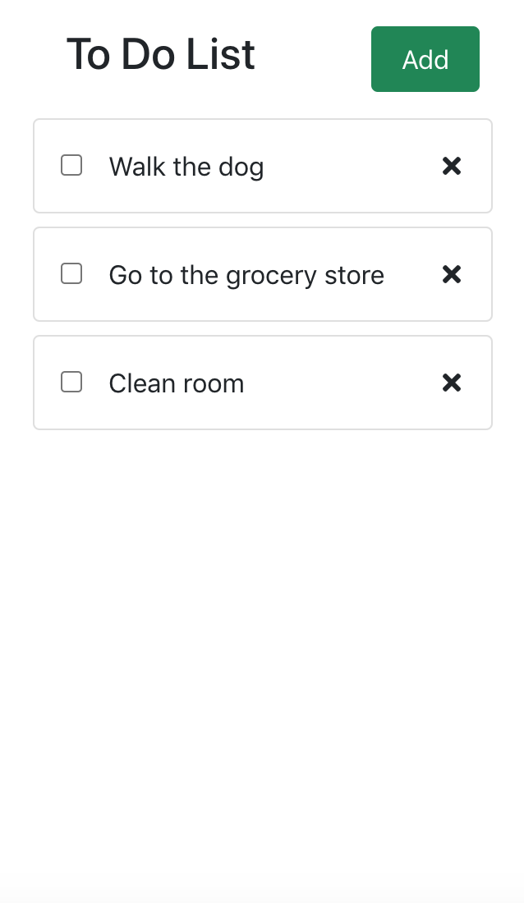
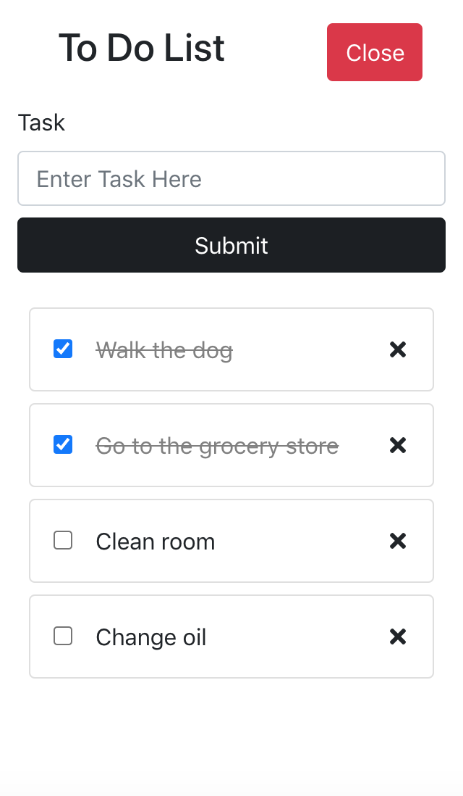

# To Do List App

This is a to-do list web application made with React JS (and styling done with Bootstrap). I learned a lot about React in this project. The application is similar in structure to a previous tutorial that I followed, which I will link below. 

Tutorial: https://www.youtube.com/watch?v=w7ejDZ8SWv8&t=1506s

## Screenshots

